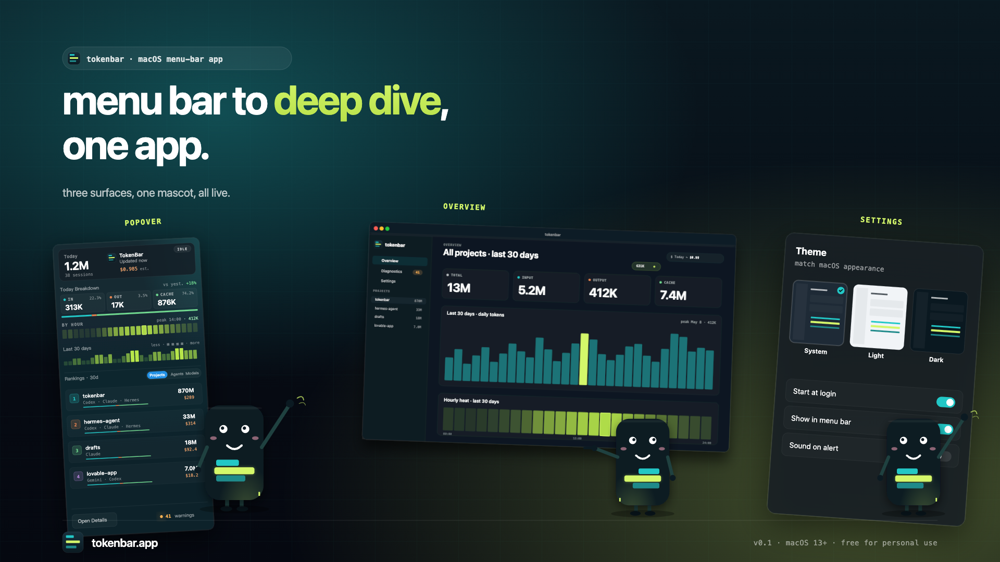
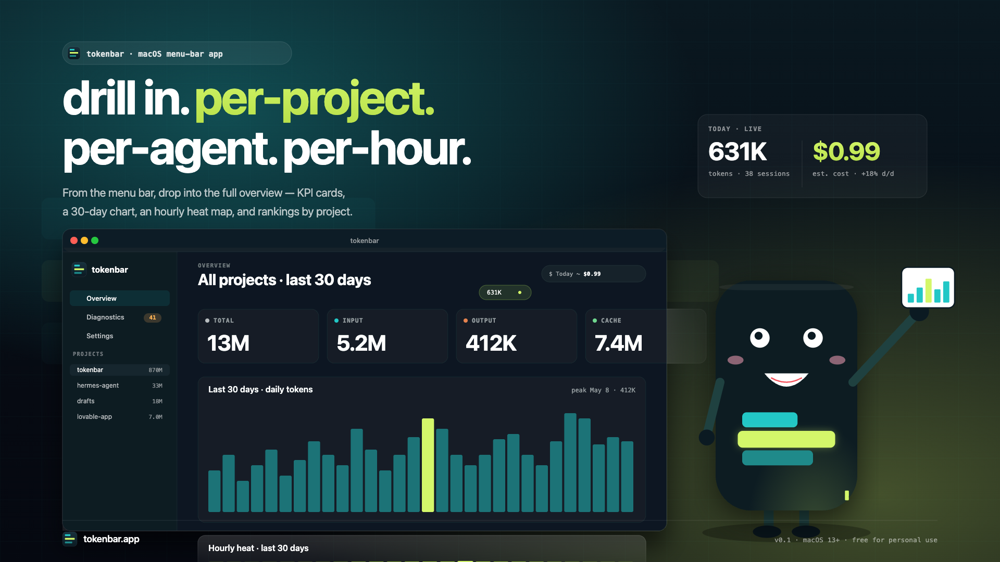
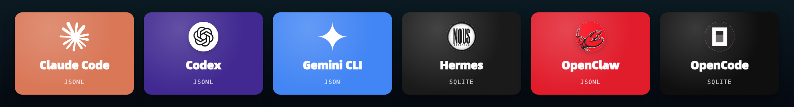
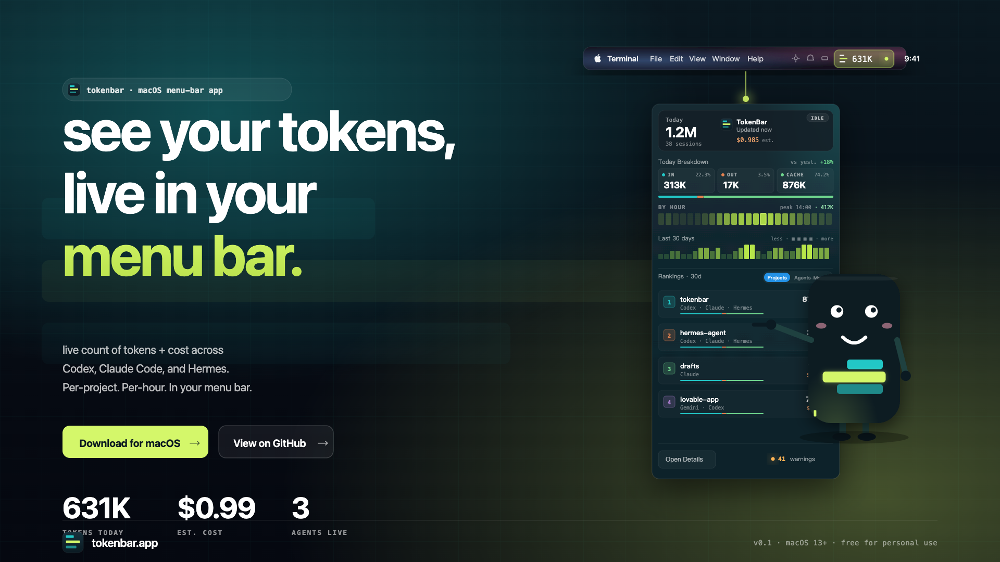

<div align="center">

# TokenBar 📊

### See your AI token spend, live.
### 把每一笔 AI 编码 token，钉在你的菜单栏上。

A macOS menu-bar app that aggregates **Claude Code · Codex · Gemini · Hermes · OpenClaw · OpenCode** usage from your local logs.
Live tokens, real cost — by project, by agent, by model. **0 upload · 0 signup · 0 account.**

[](https://www.apple.com/macos/)
[](https://www.swift.org/)
[](https://developer.apple.com/xcode/swiftui/)
[](Resources/Info.plist)
[](https://github.com/Bububuger/tokenbar/actions/workflows/ci.yml)
[](LICENSE)

[**Install**](#-install--安装) ·
[**Features**](#-features--功能) ·
[**Sources**](#-supported-sources--已支持的数据源) ·
[**CLI**](#-cli--tbar) ·
[**Wrapped Report**](#-tokenbar-report-skill--年度回顾报告) ·
[**Why**](#-why-tokenbar--为什么做-tokenbar) ·
[**Build**](#%EF%B8%8F-build-from-source--从源码构建)

<br />



</div>

---

## ✨ Why TokenBar / 为什么做 TokenBar

You're paying for Claude, Codex, Gemini and a long tail of CLI agents that all silently burn tokens on disk. The bills land monthly; the answers don't. **TokenBar reads the logs those agents already write locally** and gives you the one number you actually want — *what does today look like, by project, by model, in real money* — without ever shipping a byte off your machine.

> **中文**：你同时在用 Claude、Codex、Gemini 和一堆命令行 Agent，每家都在悄悄烧 token，账单按月寄来、明细却拼不起来。TokenBar 直接读这些 Agent **已经写在本地磁盘上**的日志，把"今天花了多少、按项目 / 按模型 / 折成多少钱"这件唯一你真正关心的事，钉在菜单栏上 —— 全程本地，0 上传、0 注册。

<br />

## ⚡ Features / 功能

|   | Feature | What it does |
|---|---|---|
| 🟩 | **Menu-bar first** | A cascade-fill glyph that grows with today's tokens vs. your 30-day peak. A glance, not a tab. <br/> *菜单栏图标会随今日 token 占 30 天峰值的比例「水位上涨」，一眼即看，不必再切窗口。* |
| 💰 | **Real cost, by model** | USD per million tokens, with per-model price overrides and instant delta recompute. <br/> *每百万 token 美元计价、支持自定义覆盖；改完立刻全局重算。* |
| 🔒 | **Local-only** | No agents, no sidecars, no account. *"Local-first. Nothing ever leaves your machine."* <br/> *无 Agent、无 sidecar、无账号 —— 一切数据都在本机 SQLite。* |
| 🔎 | **Drill into the source** | Click the popover, slice by project · agent · model · session · prompt. <br/> *点开 Popover 即可按 项目 · Agent · 模型 · 会话 · Prompt 任意切片下钻。* |
| 🎴 | **`tokenbar-report` skill** | Wrapped-style yearly recap across **3 anime power-system personas** (BLEACH · Hunter × Hunter · JOJO) — pick a card, get a different lens on the same dataset; lens-isolation gate keeps the three reports < 30% overlap. <br/> *年度回顾以三个动漫能力体系人格切镜头（死神 / 猎人 / JOJO），抽卡随机切换；强制视角隔离 < 30% 重合度。* |
| 🛠 | **`tbar` CLI** | Fourteen subcommands — twelve read queries (`events`, `prompts`, `projects`, `sessions`, `models`, `agents`, `summary`, `timeline`, `sources`, `checkpoints`, `warnings`, `schema`), plus `rebuild` (write, full reindex) and `prompt` (saved-template `/tbar:<slug>` integration). <br/> *十四条命令，与 App 同一份本地索引；`rebuild` 是 CLI 版「Reparse all」，`prompt` 直通菜单栏保存的 `/tbar:<slug>` 模板。* |

<p align="center">
  
  <br/>
  <sub><i>Drill in — per project · per agent · per hour. The same number, six lenses.</i></sub>
</p>

<br />

## 🔌 Supported Sources / 已支持的数据源

TokenBar ships with **six** zero-config engines. Every tile is "Local-first. Nothing ever leaves your machine." — TokenBar only reads the files these CLIs already write themselves.

<p align="center">
  
</p>

**Custom sources / 自定义数据源** — *"Point TokenBar at any agent that writes JSONL or sqlite locally."* Configure path glob + field mapping in `Settings → Custom Sources`. Schema validation runs before save, so a bad path can't poison the index.

<p align="center">
  
  <br/>
  <sub><i>Click the menu bar — every source, every project, every model, in one popover.</i></sub>
</p>

<br />

## 📦 Install / 安装

> macOS 14+ · Apple silicon or Intel · ~50 MB free disk for the local SQLite index.

### Homebrew (recommended)

```bash
brew tap Bububuger/tap
brew install --cask tokenbar
```

One DMG, two surfaces: `/Applications/TokenBar.app` (the menu-bar app) and `$(brew --prefix)/bin/tbar` (the CLI, symlinked from inside the .app bundle). `brew uninstall --cask tokenbar` removes both.

### From source

```bash
git clone https://github.com/Bububuger/tokenbar.git
cd tokenbar
script/build_and_run.sh --verify     # build, run, and assert the popover renders
```

The script regenerates the Xcode project (`xcodegen generate --spec project.yml`), builds the `TokenBar` scheme, and either launches the binary directly or falls back to asking Xcode to run it if macOS Developer Mode blocks terminal-launched dev apps.

**On first launch:**

1. Grant **Full Disk Access** to TokenBar — only needed for engines whose default path is outside the sandbox (`~/.openclaw`, custom sources). The 6 built-ins are read-only.
2. Wait for the **bootstrap catch-up** banner — first index of historical sessions takes seconds-to-minutes depending on how many CLIs you've been using. Run `tbar rebuild` from the terminal if you want to force a full reparse instead.
3. Open `Settings → Custom Sources` if you want to point TokenBar at an agent that isn't one of the six built-ins.

<br />

## 🖥 CLI — `tbar`

Same local SQLite index that the app uses, exposed as a focused query surface. Everything is offline, every command supports `--json` (and most also `--ndjson`) for piping. If you installed via Homebrew, `tbar` is already on `$PATH`; from source, use `script/tbar` or symlink it into `~/.local/bin/tbar`.

```bash
tbar summary --days 30                       # totals by project / agent / model
tbar projects --since 2026-04-01 --until now
tbar prompts --agent "Claude Code" --limit 20
tbar timeline --bucket hour --days 7
tbar sessions --project tokenbar --json | jq '.[] | select(.totalTokens > 1e6)'
tbar schema --json | jq '.schema.dataWindow'  # what range of data do I actually have?
tbar prompt list                             # saved /tbar:<slug> templates
tbar rebuild                                  # CLI equivalent of the app's "Reparse all"
```

Fourteen commands in total, grouped by purpose:

| Group | Commands |
|---|---|
| **Browse rows** | `events` · `prompts` |
| **Aggregations** | `projects` · `sessions` · `models` · `agents` · `summary` · `timeline` |
| **Introspection** | `sources` · `checkpoints` · `warnings` · `schema` |
| **Saved templates** | `prompt list` · `prompt get <slug>` (slugs map to `/tbar:<slug>` slash-commands in chat clients) |
| **Write** | `rebuild` (the only command that mutates the index — full reparse with `--background` + `--cpu-percent N` knobs) |

Run `tbar help` or `tbar <command> --help` for filters, sort fields, and row schema per command. Filters that work on every read command: `--days`, `--since`, `--until`, `--day`, `--project`, `--agent`, `--model`, `--session`, `--limit`, `--sort`, `--json`, `--ndjson`.

<br />

## 🎴 `tokenbar-report` skill / 年度回顾报告

A Claude Code skill that turns your `tbar` data into a **Wrapped-style HTML deck** through three anime power-system lenses — each persona has a distinct grammar (*rank · classify · quote*), so the same dataset reads honestly differently in each report.

| Idx | Persona | 视角 | The lens it owns (vocabulary the others can't touch) |
|---|---|---|---|
| 01 | **死神 / BLEACH** | 护廷十三队·副队长档案 | 灵压 (tokens) · 斩击 (prompts) · 番队所辖 (projects) · 始解 / 卍解 持有者定位 |
| 02 | **HxH / Hunter × Hunter** | 念能力分析师·查定 | 主导系测定（强化 / 放出 / 操作 / 具现化 / 变化 / 特质）· 制约と誓约 · 自创 named ability + 修业进度 |
| 03 | **JOJO / Stand Stats** | Bruno × 荣格·替身研究员 | 6 轴 A–E 替身评级 · prompt 原文引文 + timestamp · 心理画像 |

Each persona has its **own visual theme** and a **forbidden vocabulary** — BLEACH can't say *念能力* or *替身*; HxH can't say *斩魄刀* or *Stand*; JOJO is the only one allowed to quote prompt fragments. After rendering, a Jaccard-overlap gate verifies max pairwise overlap is **strictly < 30%** (3-char n-grams, chrome stripped), so the three reports really do feel different. The landing `index.html` is a card-draw page that **reshuffles on every reload**.

```bash
# Invoke via Claude Code (the skill lives in skills/tokenbar-report/SKILL.md):
"做个我的 tbar wrapped"          # 中文触发
"give me my tokenbar 2026 recap" # English trigger
"show me what I used Claude/Codex for this year"
```

Output lands at `~/Desktop/tokenbar-report-YYYY-MM-DD/` — one folder, four HTML files (`index.html` + three personas), fully offline, infinitely re-renderable.

> Full spec lives in [`skills/tokenbar-report/`](skills/tokenbar-report/).

<br />

## 🔒 Privacy / 隐私

- **Local-only by construction.** TokenBar does not contain *any* network code in the data path. There is no telemetry endpoint, no analytics SDK, no cloud sync.
- **One SQLite database** at `~/Library/Application Support/com.javis.TokenBar/usage.sqlite` — owned by you, exportable as JSON from `Settings → Data & Retention`, wipe-able with a single click (type `RESET` to confirm).
- **Prompt capture is opt-in** and stored on the user's machine — *"Stores user-only prompts locally. Project history reveals text by default."*
- **Pricing model is local.** USD-per-million-token rates live in `Settings → Pricing` and you can override any of them per-model.

> **中文**：TokenBar 的数据通路里**没有任何网络代码**。所有索引都落在本机 SQLite，可一键导出 JSON、一键 RESET 清空。Prompt 抓取需要你显式开启，且仅存本地。

<br />

## 🏗️ Build from source / 从源码构建

```bash
# Generate the Xcode project from project.yml (any time settings change)
xcodegen generate --spec project.yml --project .

# Standard scripts — shell-first per AGENTS.md
script/build.sh               # build the TokenBar app
script/test.sh                # run TokenBarTests (swift-testing)
script/build_and_run.sh       # build, sign for dev, launch
script/build_and_run.sh --verify   # ↑ + assert popover renders
script/autoresearch_acceptance.sh  # nightly research acceptance run
script/release.sh             # bump Info.plist, archive, produce a .dmg/.zip
```

**Project layout**

```
Sources/
  TokenBar/          SwiftUI app shell · MenuBarExtra · main window · settings
  TokenBarCore/      Domain layer — parsers, aggregation, SQLite (GRDB), watchers
  TokenBarCLI/       `tbar` CLI entry + twelve query subcommands
  TokenBarProbe/     headless probe used by CI / acceptance scripts
Tests/
  TokenBarCoreTests/ swift-testing coverage for parsers + aggregation
skills/
  tokenbar-report/   Claude Code skill (3 anime-power-system personas, card-draw landing)
script/              build / test / run / release / tbar wrapper
docs/assets/         README hero + demo videos
```

Targets are wired in [`project.yml`](project.yml). The shell-first workflow is described in [`AGENTS.md`](AGENTS.md) — *Xcode is the required toolchain for this native macOS app, but the Xcode GUI should not be the default development driver.*

<br />

## 🤝 Contributing / 参与

TokenBar is intentionally small — the bar for changes is "does it still feel like a glance, not a tab?". The short version of how to contribute lives in [`CONTRIBUTING.md`](CONTRIBUTING.md); the full collaboration workflow is in [`AGENTS.md`](AGENTS.md).

- **New data source?** Try **Custom Sources** in Settings first. If that's not enough, see [`Sources/TokenBarCore/Services/`](Sources/TokenBarCore/Services/) for the engine pattern.
- **Bugs**: file via the templates at [Issues → New](https://github.com/Bububuger/tokenbar/issues/new/choose) — the bug template asks which of the 6 sources is affected.
- **Security**: please **do not** file public issues; see [`SECURITY.md`](SECURITY.md).

<br />

## 📜 License / 许可

TokenBar is licensed under the **[Apache License, Version 2.0](LICENSE)** — permissive, includes an explicit patent grant, compatible with the MIT-licensed dependencies we ship against. See [`NOTICE`](NOTICE) for attribution.

Separately, [`LEGAL.md`](LEGAL.md) establishes a **comment-language priority** rule: when Chinese-language source-code comments conflict with translations, the Chinese version is authoritative. This is a documentation convention, not a license term.

> **中文**：TokenBar 采用 **[Apache License 2.0](LICENSE)** —— 宽松、含显式专利授权、与依赖项的 MIT 协议兼容。三方致谢见 [`NOTICE`](NOTICE)。<br/>另：[`LEGAL.md`](LEGAL.md) 规定**代码注释优先语言**为中文（当中文注释与其它语言注释冲突时以中文为准），属文档约定，不是许可证条款。

<br />

## 🙏 Credits / 致谢

- Database: [GRDB.swift](https://github.com/groue/GRDB.swift)
- Inspirations: [`steipete/CodexBar`](https://github.com/steipete/CodexBar) for the menu-bar-first form factor; [`warpdotdev/warp`](https://github.com/warpdotdev/warp) for the agentic-development framing.
- Built by [@Bububuger](https://github.com/Bububuger).

<br />

<div align="center">


<sub>Made for people who want to know what their AI tools actually cost — without giving up another byte to find out.</sub>

</div>
